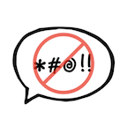

# Toxicity Warning Jira Issue Panel

Help your team avoid a toxic culture by identifying Jira Issues that could come across as insulting, threatening, or otherwise toxic... using machine learning.

Analysis is performed with TensorFlow.js in the cloud.

## Technology

* Atlassian Forge
* TensorFlow.js
* TF Toxicity classifier

## Development

See [Set up Forge](https://developer.atlassian.com/platform/forge/set-up-forge/) for instructions to get set up.

- Build and deploy your app by running:
```
forge deploy
```

- Install your app in an Atlassian site by running:
```
forge install
```

- Develop your app by running `forge tunnel` to proxy invocations locally:
```
forge tunnel
```

### Notes
- Use the `forge deploy` command when you want to persist code changes.
- Use the `forge install` command when you want to install the app on a new site.
- Once the app is installed on a site, the site picks up the new app changes you deploy without needing to rerun the install command.
